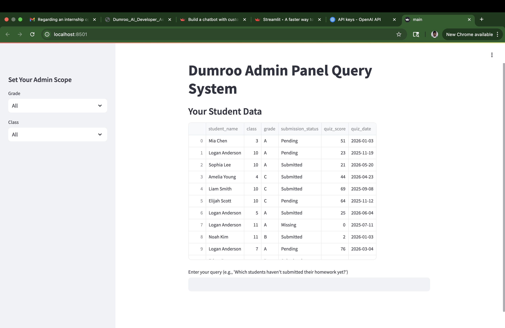
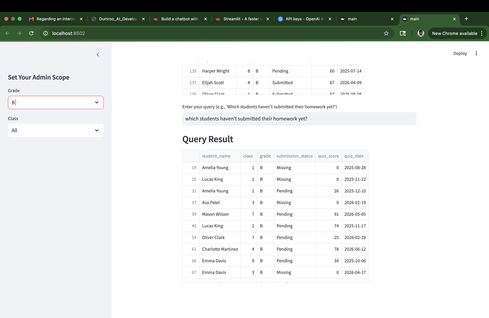
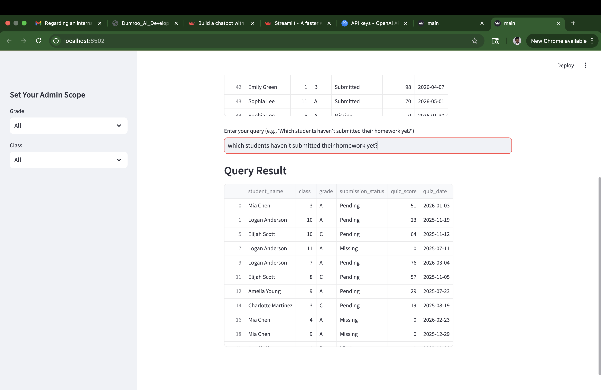
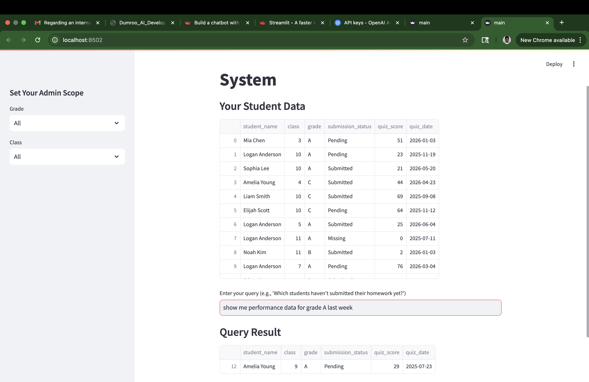

# Dumroo AI Developer Assignment

## Overview

This project implements an AI-powered query system for the Dumroo Admin Panel, allowing admins to ask natural language questions about student data with role-based access control (RBAC). The system supports queries like "Which students haven't submitted their homework yet?" and restricts data based on admin roles (grade, class, region). It includes a Streamlit UI .

## Setup

1. Clone the repository: `git clone <your-repo-url>`
2. Create a virtual environment: `python -m venv env && source env/bin/activate` (Mac/Linux) or `env\Scripts\activate` (Windows)
3. Install dependencies: `pip install -r requirements.txt`
4. Ensure `student_data.csv` is in the project directory
5. Run the Streamlit app: `streamlit run main.py`
6. (Alternative) Run the CLI version: Uncomment `run_cli()` in `main.py` and run `python main.py`

## Requirements

- Python 3.8+
- Packages: `pandas`, `langchain`, `langchain-community`, `transformers`, `streamlit`
- See `requirements.txt` for details

## Example Queries

- "Which students haven't submitted their homework yet?"
- "Show me performance data for Grade A from last week"
- "List all upcoming quizzes scheduled for next week"

## Implementation Details

- **Dataset**: `student_data.csv` contains student data with columns: `student_name`, `class`, `grade`, `submission_status`, `quiz_score`, `quiz_date`.
- **NLP**: Uses Hugging Face's `gpt2` model with LangChain to parse queries and map to Pandas filters, with keyword-based fallback for robustness.
- **RBAC**: Restricts data access dynamically via sidebar selections in Streamlit.
- **Streamlit UI**: Allows admins to select scope (grade, class) and enter queries, with an exit button or "exit" query to stop.
- **Modularity**: Code is structured for easy database integration (e.g., replace `load_data` with DB connection).

## Notes

1. Uses `gpt2` for free NLP processing; replace with OpenAI if you have an API key for better performance.
2. Fallback keyword-based query processing ensures functionality for common queries.
3. Streamlit app uses session state to handle exit conditions; refresh the browser to restart after exiting.

### Home Page

*The main landing page of the Dumroo Admin Panel, where admins can set their scope and view student data.*

### RBAC Scope Selection

*Sidebar feature allowing admins to select their grade and class for dynamic role-based access control.*

### Query Result Example

*Example of a query result displayed after entering a natural language query.*